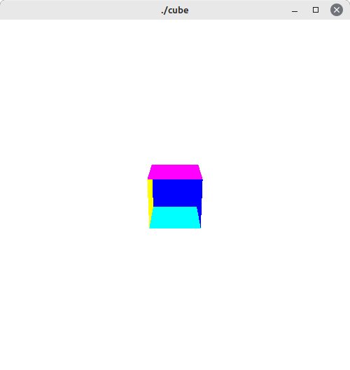

# Visualização 3D

> vamos entender algumas caracteristicas de como a visualização 3D funciona em computação gráfica

## 🤓 Estudando um exemplo

O **exemplo 3.1**, usado para estudo desta seção está disponível [aqui](https://www.dca.ufrn.br/~lmarcos/courses/compgraf/redbook/chapter03.html). Foi feito algumas alterações a fins de experimentos.

Vamos analisar as funções `display` e `reshape` do código:

### [1/2] 🖥️ Função Display

Vamos analisar os principais pontos desta função:

```c
void display(void)
{
   glClear (GL_COLOR_BUFFER_BIT); //apaga tudo (fica tudo com a cor definida no buffer)
   glLoadIdentity ();             /* clear the matrix - forma de garantir que as proximas transformações sejam executadas sem interferencias de transformações anteriores*/ 

   /* viewing transformation  */
   gluLookAt (2.0, 0.0, 5.0,  //posição da camera
              0.0, 0.0, 0.0,  //onde a camera esta apontando
              0.0, 1.0, 0.0); //vetor up da camera

   drawCube();
   glFlush ();
}
```

#### 🚩 Transformação de Visualização

Em computação gráfica, a tranformação de visualização é aplicado na câmera. geralmente essas tranformações são aplicadas para levar a câmera para a posição de mundo (quando ela esta em uma posição diferente da de mundo) e também para definir a orientação dela. Em **OpenGL** usamos a função `glLookAt()`

- **O que é glLookAt()?**: é a matriz que irá definir a posição e a orientação da câmera. Ela possui 9 parâmetros que se dividem em 3 vetores, sendo eles:
    1. **vetor (x,y,z)** = posicao da camera 
    2. **vetor (x,y,x)** = onde a camera esta apontando
    3. **vetor (x,y,x)** = up da camera

#### 🚩 Função drawCube()

A função `drawCube()` irá desenhar um cubo e irá pintar as faces de uma cor:

```c
void drawCube() {
    // Define as coordenadas dos vértices do cubo
    float vertices[][3] = {
        {-0.5, -0.5, -0.5}, // Vértice 0
        {0.5, -0.5, -0.5},  // Vértice 1
        {0.5, 0.5, -0.5},   // Vértice 2
        {-0.5, 0.5, -0.5},  // Vértice 3
        {-0.5, -0.5, 0.5},  // Vértice 4
        {0.5, -0.5, 0.5},   // Vértice 5
        {0.5, 0.5, 0.5},    // Vértice 6
        {-0.5, 0.5, 0.5}    // Vértice 7
    };

    // Define as faces do cubo
    int faces[][4] = {
        {0, 1, 2, 3}, // Face frontal
        {1, 5, 6, 2}, // Face lateral direita
        {5, 4, 7, 6}, // Face traseira
        {4, 0, 3, 7}, // Face lateral esquerda
        {3, 2, 6, 7}, // Face superior
        {0, 4, 5, 1}  // Face inferior
    };

    // Cores para cada face do cubo
    float colors[][3] = {
        {1.0, 0.0, 0.0}, // Vermelho
        {0.0, 1.0, 0.0}, // Verde
        {0.0, 0.0, 1.0}, // Azul
        {1.0, 1.0, 0.0}, // Amarelo
        {1.0, 0.0, 1.0}, // Magenta
        {0.0, 1.0, 1.0}  // Ciano
    };

    // Desenha o cubo
    glBegin(GL_QUADS);
    for (int i = 0; i < 6; i++) {
        glColor3fv (colors[i]);
        for (int j = 0; j < 4; j++) {
            glVertex3fv(vertices[faces[i][j]]);
        }
    }
    glEnd();
}
```

Temos três pontos importantes para se desenhar um cubo em **OpenGL**:

1. para criarmos um quadrilatero precisamos iniciar com **glBegin(GL_QUADS)**;
2. precisamos definir os verticies do nosso cubo, e a partir dai as suas faces. usamos a função **glVertexfv()** que recebe as coordenadas (x,y,z) dos verticies definidos usando um laço para percorrer cada face;
3. finalizamos usando o **glEnd()**

#### 🚩 O que o glFlush() faz?

A função glFlush() em OpenGL força a execução imediata de todos os comandos OpenGL pendentes. Normalmente, o OpenGL mantém um buffer de comandos para otimizar o desempenho, agrupando vários comandos semelhantes antes de executá-los. No entanto, em certos casos, você pode querer forçar a execução imediata de todos os comandos para garantir que eles sejam renderizados na tela o mais rápido possível.

### [2/2] ↗️ Função Reshape

essa função reshape tem o objetivo de redimencionar a tela:

```c
 void reshape (int w, int h)
{
   glViewport (0, 0, (GLsizei) w, (GLsizei) h); 
   glMatrixMode (GL_PROJECTION);
   glLoadIdentity ();
   glFrustum (-1.0, 1.0, -1.0, 1.0, 1.5, 20.0);
   glMatrixMode (GL_MODELVIEW);
}
```

#### 🚩 Função glViewport()

A função `glViewport()` define a área da janela OpenGL onde a renderização ocorrerá. Os quatro parâmetros especificam a posição (canto inferior esquerdo) e as dimensões da viewport (largura e altura). Neste caso, estamos definindo a viewport para cobrir toda a janela.

#### 🚩 Função glFrustum()

A função glFrustum em OpenGL é usada para definir uma matriz de projeção de perspectiva. Essa matriz define um volume de visualização trapezoidal (frustum) que é usado para projetar objetos tridimensionais em uma tela bidimensional de forma perspectiva. Aqui está uma explicação detalhada dos parâmetros da função glFrustum:

- **left**: a coordenada x do plano esquerdo do frustum no espaço do olho.
- **right**: a coordenada x do plano direito do frustum no espaço do olho.
- **bottom**: a coordenada y do plano inferior do frustum no espaço do olho.
- **top**: a coordenada y do plano superior do frustum no espaço do olho.
- **nearVal**: a distância do plano de visão mais próximo (perto) ao longo do eixo z negativo.
- **farVal**: a distância do plano de visão mais distante (longe) ao longo do eixo z negativo.

A matriz de projeção de perspectiva resultante cria um efeito de distorção que simula a forma como os objetos aparecem em uma cena tridimensional quando vistos de uma determinada posição e orientação da câmera. O frustum define a região do espaço tridimensional que será mapeada para a tela 2D.

No nosso exemplo temos: **glFrustum(-1.0, 1.0, -1.0, 1.0, 1.5, 20.0)**, que estará definindo um frustum simétrico com um plano esquerdo em x = -1.0, um plano direito em x = 1.0, um plano inferior em y = -1.0, um plano superior em y = 1.0, um plano próximo em z = -1.5 e um plano distante em z = -20.0. Isso cria um volume de visão trapezoidal que se estende de -1.5 a -20.0 unidades ao longo do eixo z negativo, com -1.0 e 1.0 unidades de largura e altura ao longo dos eixos x e y.

## 🧪 Como Executar este código?

para a compilação e execução do arquivo `cube.c` use os seguintes comandos: 

```bash
$ gcc -o cube cube.c -lm -lGL -lGLU -lglut
$ ./cube
```

se você executar esse comando acima deverá obter uma janela com a seguinte imagem do cubo:

<p align="center">
    
</p>